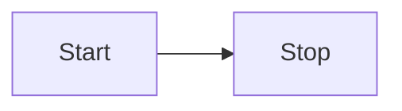
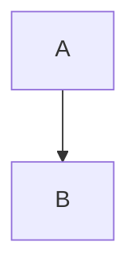

# 安装和测试指南

## 安装步骤

1. **确保 Obsidian 中有测试 vault**
   - 打开 Obsidian
   - 创建或打开一个测试 vault

2. **安装插件**
   - 在你的测试 vault 目录中，找到 `.obsidian/plugins/` 文件夹
   - 如果没有，请先在 Obsidian 设置中启用 "第三方插件"
   - 创建插件目录：`.obsidian/plugins/mermaid-preview/`
   - 复制这三个文件到该目录：
     - `main.js`
     - `manifest.json` 
     - `styles.css`

3. **启用插件**
   - 在 Obsidian 中打开设置
   - 转到 "第三方插件"
   - 找到 "Mermaid Preview" 并启用它
   - 检查开发者控制台是否有加载日志

## 测试步骤

1. **创建测试文件**
   在 Obsidian 中创建新文件，输入：

```markdown
# Mermaid Test




````

2. **检查结果**
   - 切换到预览模式
   - 你应该看到渲染的图表和下方的工具栏
   - 打开开发者控制台 (Ctrl+Shift+I 或 Cmd+Option+I) 查看调试日志

## 调试

如果不工作：

1. **检查控制台日志**
   - 应该看到 "Mermaid Preview Plugin: Starting onload..."
   - 应该看到 "Mermaid code block processor registered"
   - 如果处理 mermaid 代码块，应该看到 "🎯 Mermaid code block detected!"

2. **常见问题**
   - 确保使用 ````mermaid` 而不是其他语言标识符
   - 确保在预览模式而不是编辑模式
   - 尝试重新加载 Obsidian
   - 检查插件是否真正启用

3. **重新构建** (如果修改了代码)
   ```bash
   node esbuild.config.mjs production
   ```